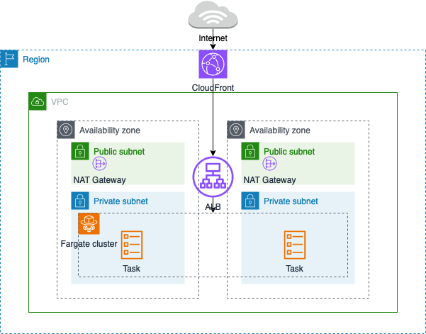
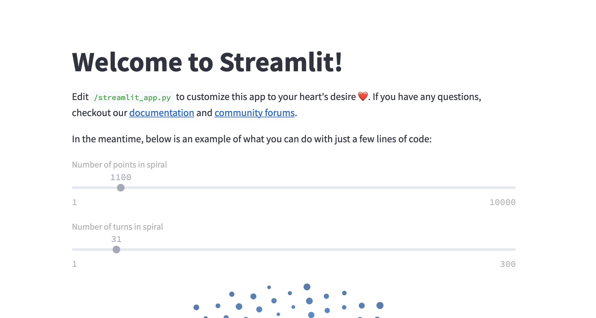

## Streamlit on ECS 

Streamlit (https://streamlit.io/) provides a fast and easy way to build web apps and does not require front end development knowledge. Streamlit is a popular prototyping tool and is featured extensively in AWS Blog Articles, Labs, Workshops and Immersion Days. Most of these resources will run an ad-hoc instance of Streamlit - usually directly in the developer's IDE or Jupyter notebook. While this is great for learning and fast prototyping, it is not suitable for deploying a reliable Streamlit app.

This is a simple project showcasing a Streamlit deployment on Amazon ECS using AWS CDK to provision the infrastructure resources. 
It also provides instructions on packaging the default Streamlit 'hello-world' app as a container image. The CDK will create the following resources:



## Deployment steps

### 1. Create the Docker image and push it to a repository.

1.1 You will need Docker engine. See Docker installation guide here: https://docs.docker.com/engine/install/#server
Ensure you have Docker engine installed by running the `hello-world` Docker image:

```
sudo docker run hello-world
```

1.2 Navigate to the `streamlit` directory and build the Streamlit container image:

```
docker build -t streamlit .
```

You can test the container locally using:

```
docker run -p 80:80 streamlit
```

1.3 Push the image to a container repository. You can find a guide on how to create and push images to public ECR repository here:
https://docs.aws.amazon.com/AmazonECR/latest/public/public-repository-create.html

1.4 Update the container image repository URL on line 40 in `streamlitecs/streamlitecs_stack.py` 

### 2. Prepare and run the CDK app

You will need a valid AWS cli profile. If you need to configure a profile, follow the instructions here:
https://docs.aws.amazon.com/cli/latest/userguide/cli-chap-configure.html

This project is set up like a standard Python project.  The initialization
process also creates a virtualenv within this project, stored under the `.venv`
directory.  To create the virtualenv it assumes that there is a `python3`
(or `python` for Windows) executable in your path with access to the `venv`
package. If for any reason the automatic creation of the virtualenv fails,
you can create the virtualenv manually.

2.1 To manually create a virtualenv on MacOS and Linux, navigate to the project's root directory and run:

```
python3 -m venv .venv
```

2.2 After the init process completes and the virtualenv is created, you can use the following
step to activate your virtualenv.

```
source .venv/bin/activate
```

If you are a Windows platform, you would activate the virtualenv like this:

```
% .venv\Scripts\activate.bat
```

2.3 Once the virtualenv is activated, you can install the required dependencies.

```
pip install -r requirements.txt
```

2.4 At this point you can now synthesize the CloudFormation template for this code.

```
cdk synth
```

To add additional dependencies, for example other CDK libraries, just add
them to your `setup.py` file and rerun the `pip install -r requirements.txt`
command.

2.5 If you need to bootstrap your CDK environment, do so now:

```
cdk bootstrap
```
  
2.6 Deploy: 

```
cdk deploy
```

The output of the deploy command will contain the CloudFront url where you can access the Streamlit app. It will look something like this:
StreamlitecsStack.CFurl = https://yourdistirbutionid.cloudfront.net

The default 'Hello World' Streamlit app should look like this:



2.7 To delete all resources provisoned use:

```
cdk destroy
```

## Useful commands

 * `cdk ls`          list all stacks in the app
 * `cdk synth`       emits the synthesized CloudFormation template
 * `cdk deploy`      deploy this stack to your default AWS account/region
 * `cdk diff`        compare deployed stack with current state
 * `cdk docs`        open CDK documentation

## Security

See [CONTRIBUTING](CONTRIBUTING.md#security-issue-notifications) for more information.

## License

This library is licensed under the MIT-0 License. See the LICENSE file.
